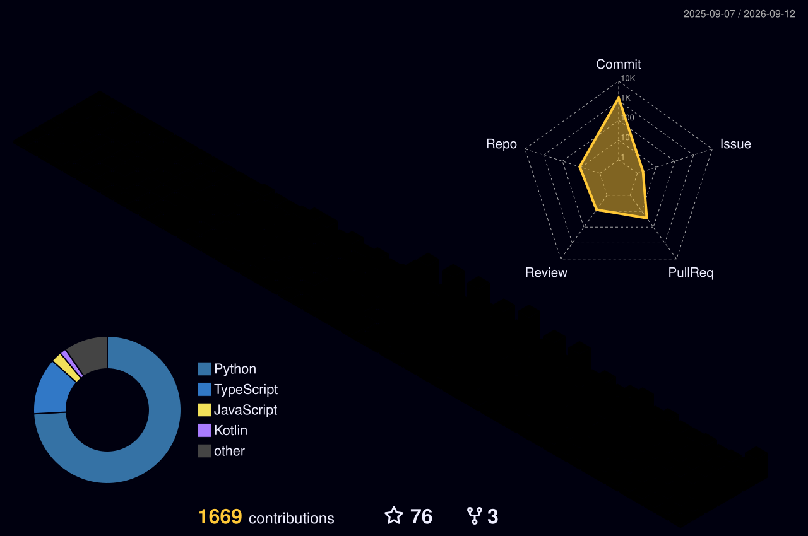
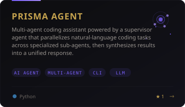
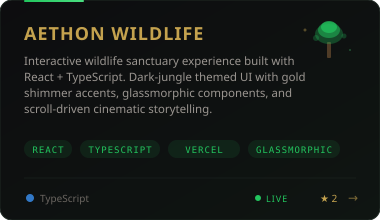
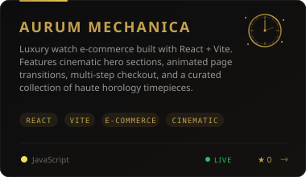

<!-- ═══════════════════════════════════════════════════════════════════════════ -->
<!--                          AYUSH SINGH · README                           -->
<!--                    Full-Stack · AI/ML · Creative Dev                    -->
<!-- ═══════════════════════════════════════════════════════════════════════════ -->

<!-- ─── CUSTOM ANIMATED HEADER ─── -->

 

<!-- ─── ANIMATED ROLE SWITCHER ─── -->

  

<!-- ─── SOCIAL LINKS — PILL STYLE ─── -->
&nbsp;
&nbsp;
&nbsp;
&nbsp;

  

<!-- ─── PROFILE METRICS BADGES ─── -->
&nbsp;&nbsp;
&nbsp;&nbsp;

 

<!-- ═══════════════════════════════════════════════════════════════════════════ -->
<!--                                 ABOUT                                    -->
<!-- ═══════════════════════════════════════════════════════════════════════════ -->

  

## `⟐ ABOUT ME ⟐`

 

<!-- ─── TERMINAL-STYLE ABOUT CARD ─── -->

 

<!-- ═══════════════════════════════════════════════════════════════════════════ -->
<!--                              TECH STACK                                  -->
<!-- ═══════════════════════════════════════════════════════════════════════════ -->

  

## `⟐ TECH ARSENAL ⟐`

 

<!-- ─── LANGUAGES ─── -->

 

  

<!-- ─── FRAMEWORKS & LIBRARIES ─── -->

 

  

<!-- ─── DATA SCIENCE ─── -->

 
&nbsp;&nbsp;
&nbsp;&nbsp;
&nbsp;&nbsp;

  

<!-- ─── DATABASES & CLOUD ─── -->

 

  

<!-- ─── TOOLS & DESIGN ─── -->

 

 

<!-- ═══════════════════════════════════════════════════════════════════════════ -->
<!--                              3D CONTRIB                                  -->
<!-- ═══════════════════════════════════════════════════════════════════════════ -->

  

## `⟐ 3D CONTRIBUTION MAP ⟐`

 

 

<!-- ═══════════════════════════════════════════════════════════════════════════ -->
<!--                           FEATURED PROJECTS                              -->
<!-- ═══════════════════════════════════════════════════════════════════════════ -->

  

## `⟐ FEATURED PROJECTS ⟐`

 

<!-- ─── PROJECT ROW 1 ─── -->

  

<!-- ─── PROJECT ROW 2 ─── -->

 

<!-- ═══════════════════════════════════════════════════════════════════════════ -->
<!--                            LEETCODE STATS                                -->
<!-- ═══════════════════════════════════════════════════════════════════════════ -->

  

## `⟐ LEETCODE ⟐`

 

 

<!-- ═══════════════════════════════════════════════════════════════════════════ -->
<!--                          SPACE SHOOTER                                   -->
<!-- ═══════════════════════════════════════════════════════════════════════════ -->

  

## `⟐ COMMIT SPACE SHOOTER ⟐`

 

 

<!-- ═══════════════════════════════════════════════════════════════════════════ -->
<!--                               FOOTER                                    -->
<!-- ═══════════════════════════════════════════════════════════════════════════ -->

  

<!-- ─── ANIMATED FOOTER ─── -->

  

  

